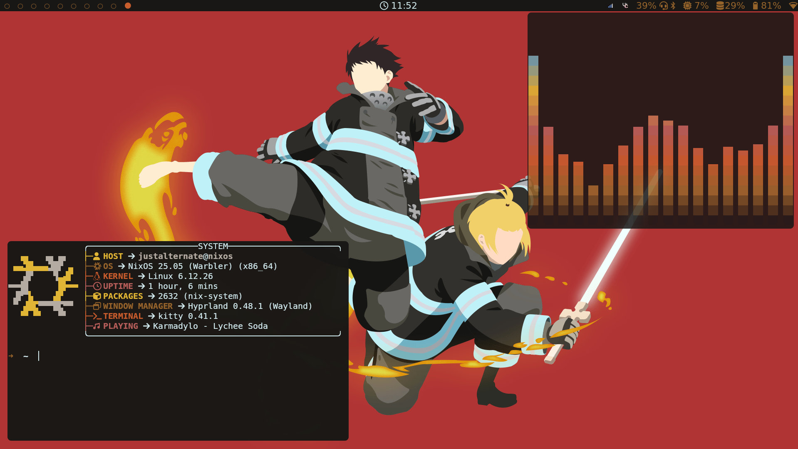

# nixcfg

This repository contains the declaration of my systems running [Nix/NixOS](https://nixos.org/)

- Beaver: My VPS running NixOS and selfhosting services
- Swordfish: My NixOS desktop gaming station which I also use for intensive computation.
- Parrot: My NixOS semi gaming laptop which I mainly use for study and abroad.
- Owl: My arm processor Mac M1.
- Gecko: My raspberry py configs (WIP)

## My very pywal centric NixOS Hyprland rice

(For both Swordfish and Parrot)



### Video Showcase [11 Aug 2024] (slightly outdated)

[](https://www.youtube.com/watch?v=M6VRL6bqdks)
_click the image to go to the video_

(Im no longer using eww nor pywalfox nor conky for my rice)


### Features

#### Desktop (Swordfish and Parrot)
- DE: [Hyprland](https://hyprland.org/)
- Terminal: [Kitty](https://sw.kovidgoyal.net/kitty/)
- Bar: [Waybar](https://github.com/Alexays/Waybar)
- File Manager: [yazi](https://yazi-rs.github.io/)
- Editor: Neovim [justnixvim](https://github.com/JustAlternate/justnixvim)
- Fetcher: [fastfetch](https://github.com/fastfetch-cli/fastfetch)
- Font: [nerdfonts](https://www.nerdfonts.com/)
- Launcher: [rofi-wayland](https://github.com/A417ya/rofi-wayland)
- Browser: [firefox](https://www.mozilla.org/en-US/firefox/)
- Discord: [Vesktop](https://github.com/Vencord/Vesktop)
- Emoji wheel: rofi + [bemoji](https://github.com/marty-oehme/bemoji)
- Music Visualizer: [cava](https://github.com/karlstav/cava)
- Secrets: [sops-nix](https://github.com/Mic92/sops-nix)

#### VPS (Beaver)
- Reverse proxy & web server: [nginx](https://nginx.org/en/)
- Monitoring (observability) : [Grafana](https://github.com/grafana/grafana)
- Monitoring (metric collector): [Prometheus](https://github.com/prometheus/prometheus)
- Monitoring (logs aggregator): [Loki](https://github.com/grafana/loki)
- Mail server: [Simple nixos mail server](https://gitlab.com/simple-nixos-mailserver/nixos-mailserver)
- Kanban: [Planka](https://github.com/plankanban/planka)
- Cloud storage server: [Owncloud](https://owncloud.com/)
- Password management: [Vaultwarden](https://github.com/dani-garcia/vaultwarden)
- AI frontend : [openwebui](https://github.com/open-webui/open-webui)
- Sharing gps location service: [Dawarich](https://github.com/Freika/dawarich)
- Selfhosted CI/CD runner: [github-runners](https://github.com/actions/runner)
- Minecraft server: [docker-minecraft](https://github.com/itzg/docker-minecraft-server)
- S3 auto backup service: made by myself

## Installation

Enter a shell with git and vim.
```
nix-shell -p git vim
```

Clone the repository and enter it
```
git clone https://github.com/JustAlternate/nixcfg
cd nixcfg
```

Create your very own host folder
```
mkdir <myMachineName>
```

Create your hardware config
```
nixos-generate-config --show-hardware-config > <myMachineName>/hardware-configuration.nix
```

Modify your host configuration by importing different modules
```
vim <myMachineName>/configuration.nix
```

Modify the flake.nix to add your machine
```
vim flake.nix
```

Temporary activate flakes experimental features and rebuild switch
```
NIX_CONFIG="experimental-features = nix-command flakes"
sudo nixos-rebuild switch --flake .#<myMachineName>Nixos
```

## Advanced Install process (optional)

Create a `.ssh` folder and populate it with your ssh private key
```
mkdir -p ~/.ssh
ssh-keygen -t ed25519 -C "email@email.com"
```

Create your sops age private key
```
sudo mkdir -p /nix/sops/age
sudo nix-shell -p ssh-to-age --run "ssh-to-age -private-key -i ~/.ssh/id_ed25519 > /nix/sops/age/keys.txt"
```
