# nixcfg

This repository contains the declaration of my systems running [Nix/NixOS](https://nixos.org/)

- beaver: My VPS running NixOS and selfhosting services (login only through yubikey)
- swordfish: My Desktop running NixOS desktop. (login only through yubikey)
- parrot: My Laptop running NixOS.
- owl: My arm processor Mac M1 running [nix-darwin](https://github.com/nix-darwin/nix-darwin).
- gecko: My raspberry py configs (WIP)

### Features

#### VPS (beaver)
- Identity management : [keycloak](https://keycloak.org) (with SSO using github provider or yubikey)
- Reverse proxy & web server: [nginx](https://nginx.org/en/)
- Monitoring (observability) : [Grafana](https://github.com/grafana/grafana) (only accessible through Keycloak)
- Monitoring (metric collector): [Prometheus](https://github.com/prometheus/prometheus)
- Monitoring (logs aggregator): [Loki](https://github.com/grafana/loki)
- Mail server: [Simple nixos mail server](https://gitlab.com/simple-nixos-mailserver/nixos-mailserver)
- Password management: [Vaultwarden](https://github.com/dani-garcia/vaultwarden) (only accessible through Keycloak)
- LLM frontend : [openwebui](https://github.com/open-webui/open-webui) (only accessible through Keycloak)
- Sharing gps location service: [Dawarich](https://github.com/Freika/dawarich)
- Security: sops-nix (secrets management), Fail2Ban (intrusion prevention)

##### Infrastructure Overview (Beaver VPS)

```mermaid
flowchart LR
    subgraph Internet["🌐 Internet"]
        Users["Users"]
        GitHub["GitHub"]
        Cloudflare["Cloudflare<br/>(DNS)"]
    end

    subgraph Beaver["🖥️ Beaver VPS"]
        
        subgraph Network["🕸️ Network Layer"]
            Firewall["🔥 UFW Firewall<br/>TCP: 443, 8443, 9111<br/>Mail: 25, 465, 587, 993"]
            Nginx["🌐 Nginx<br/>Reverse Proxy + SSL"]
        end

        subgraph Security["🔒 Security Layer"]
            Sops["SOPS<br/>(Secrets Management)"]
        end

        subgraph Services["🚀 Self-Hosted Services"]
            Vaultwarden["Vaultwarden<br/>(Passwords)"]
            OpenWebUI["OpenWebUI<br/>(LLM Frontend)"]
            Mail["Simple NixOS Mail<br/>(Postfix/Dovecot)"]
            Dawarich["Dawarich<br/>(GPS Tracking)"]

            subgraph Monitoring["🔍 Monitoring"]
                Promtail["Promtail (Logs)"]
                Loki["Loki (Logs)"]
                Prometheus["Prometheus (Metrics)"]
                Grafana["Grafana<br/>"]
            end

            subgraph Auth["🔐 Identity Layer"]
                Keycloak["Keycloak SSO<br/>"]
            end
        end
    end

    %% External Traffic
    Users --> Cloudflare
    Cloudflare -->|"HTTPS (443)"| Firewall
    Users -->|"SSH (8443)"| Firewall

    %% Internal Routing
    Firewall -->|"Proxy"| Nginx

    %% Monitoring Flow
    Promtail --> Loki
    Loki --> Grafana

    Prometheus --> Grafana

    Sops -->|"Secret"| Grafana

    Keycloak -->|"OIDC"| Grafana

    Sops -->|"Secret"| Vaultwarden
    Sops -->|"Secret"| Mail
    Sops -->|"Secret"| Keycloak

    GitHub -->|"IdP"| Keycloak

    %% Auth Flow
    Keycloak -->|"OIDC"| OpenWebUI
    Keycloak -->|"OIDC"| Dawarich
    Keycloak -->|"OIDC"| Vaultwarden

    Sops -->|"Secret"| Dawarich

```



##### Monitoring Dashboards :


#### Desktop (swordfish and parrot)
- DE: [Hyprland](https://hyprland.org/)
- Terminal: [Ghostty](https://ghostty.org/)
- Bar: [Waybar](https://github.com/Alexays/Waybar)
- File Manager: [yazi](https://yazi-rs.github.io/)
- Editor: Neovim [justnixvim](https://github.com/JustAlternate/justnixvim)
- Fetcher: [fastfetch](https://github.com/fastfetch-cli/fastfetch)
- Font: [nerdfonts](https://www.nerdfonts.com/)
- Launcher: [rofi](https://github.com/A417ya/rofi-wayland)
- Browser: [firefox](https://www.mozilla.org/en-US/firefox/)
- Discord: [Vesktop](https://github.com/Vencord/Vesktop)
- Emoji wheel: rofi + [bemoji](https://github.com/marty-oehme/bemoji)
- Music Visualizer: [cava](https://github.com/karlstav/cava)
- Secrets: [sops-nix](https://github.com/Mic92/sops-nix)
- Yubikey only login with automatic screen lock when not detected. 

## Installation

Enter a shell with git and vim.
```
nix-shell -p git vim
```

Clone the repository and enter it
```
git clone https://github.com/JustAlternate/nixcfg
cd nixcfg
```

Create your very own host folder
```
mkdir <myMachineName>
```

Create your hardware config
```
nixos-generate-config --show-hardware-config > <myMachineName>/hardware-configuration.nix
```

Modify your host configuration by importing different modules
```
vim <myMachineName>/configuration.nix
```

Modify the flake.nix to add your machine
```
vim flake.nix
```

Temporary activate flakes experimental features and rebuild switch
```
NIX_CONFIG="experimental-features = nix-command flakes"
sudo nixos-rebuild switch --flake .#<myMachineName>Nixos
```

## Advanced Install process (optional)

Create a `.ssh` folder and populate it with your ssh private key
```
mkdir -p ~/.ssh
ssh-keygen -t ed25519 -C "email@email.com"
```

Create your sops age private key
```
sudo mkdir -p /nix/sops/age
sudo nix-shell -p ssh-to-age --run "ssh-to-age -private-key -i ~/.ssh/id_ed25519 > /nix/sops/age/keys.txt"
```
